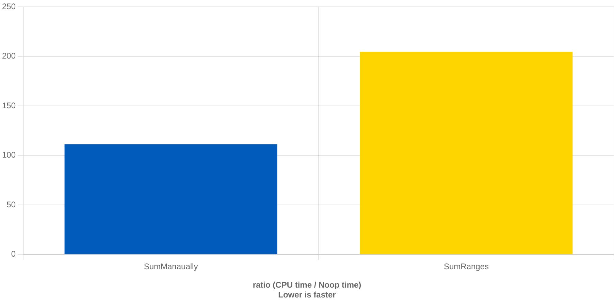

# transform | filter — zero-cost абстракция, за которую нужно платить дважды

Когда С++20 анонсировал добавление `ranges` в стандарнтую библиотеку, вокруг было очень много обсуждений.
Кто-то радовался (как, например, я, по наивности), кто-то наоборот высказывал опасения насчет этой новой и якобы удобной функциональности. Особенно много возмущений и критики было со стороны разработчиков игр:

- Эти шаблоны на шаблонах компилируются долго! (и это правда)
- Старый добрый for loop читается проще (это сомнительно)
- Эти абстракции дают еще и штраф в производительности (а вот это мы сейчас и обсудим)

Пример с бэнчмарком `transform | filter` против обычного старого дедовского for-loop обсуждался на форумах, показывался на конференциях, ну и здесь тоже без него не обойдется.

Как известно, [std::ranges примудали чтоб в C++ было удобнее реализовывать печать календаря](https://www.youtube.com/watch?v=8yV2ONeWXyI&t=1s), а также суммировать квадраты чисел. Календарь печатать слишком долго, поэтому будем суммировать квадраты.

```C++
// Суммировать будем "маленькие" квадраты, чтоб как-то оправдать использование filter после transform


// Будем суммировать вручную, старым проверенным способом
static int sum_small_squares_manualy(std::vector<int>& v) {
  int sum = 0;
  for (int x : v) {
      int sq = x * x;
      if (sq < 100) {
        sum += sq;
      }
  }
  return sum;
}


// А тут просуммируем используя почти всю мощь современного C++: ranges::views!
static int sum_small_squares_ranges(std::vector<int>& v) {
  namespace views = std::ranges::views;
  int sum = 0;
  auto square = [](int x) { return x * x; };
  auto small = [](int x) { return x < 100; };
  for (int x : v | views::transform(square) 
                 | views::filter(small)) {
      sum += x;
  }
  return sum;
}
```

И запустим [бенчмарк](https://quick-bench.com/q/U0eEAzI6Evm9_KLBK39zIYdGI74). Результат его, скорее всего, известен моему читателю (ну правда, его везде показывали!):

Версия std::ranges почти ровно в 2 раза медленнее чем традиционная реализация



Что для libc++, что для libstdc++, что для Clang, что для GCC. Все едино.

Самое страшное, что это не какая-то упущенная оптимизация комиляторов. Это так и задумано.

----

Обычно в этом сборнике я овещаю случаи undefined и unspecified поведения. И очень редко какие-то well-defined вещи. Однако, ситуация с `transform | filter` сочетанием оказалась настолько неожиданной, что обойти ее стороной нельзя. И речь не о производительности.

Давайте попробуем другой пример, более приближенный к реальности. Ведь на C++ не только квадраты считают, но еще и какую-то бизнес-логику программируют.

Вы подготовили список API calls запросов к AWS и собиратесь их исполнить, какие-то могут завершиться ошибкой, какие-то выполниться успешно. 

Конструкция 
`requests | transform(execute) | filter(succeded)` выглядит очень чисто, красиво и понятно.

Вы пишете ее, используете, тестируете -- вроде все отлично работает, загоняете в продакшен... И потом получаете удвоенный счет от AWS.

Что? А давайте [посмотрим](https://godbolt.org/z/zj64eb1sG):

```C++
using Response = std::string;
using Request = int;
using Error = int;

auto execute_request(Request r) -> std::expected<Response, Error> {
    std::print("Executing request {}\n", r);
    if (r % 2 == 0) {
        return std::format("{}", r);
    } else {
        return std::unexpected(r);
    }
}

int main() {
    namespace views = std::ranges::views;
    std::vector<Request> requests = { 1, 2, 3, 4, 5, 6 };
    constexpr auto successful = [](auto&& response) { return response.has_value(); };
    for (auto resp : requests | views::transform(execute_request) 
                              | views::filter(successful)) {
        std::print("got result: {}\n", *resp);
    }
}
```

```
Executing request 1
Executing request 2
Executing request 2
got result: 2
Executing request 3
Executing request 4
Executing request 4
got result: 4
Executing request 5
Executing request 6
Executing request 6
got result: 6
```

Глядите-ка! Все успешные реквесты выполнились **дважды**!...

Ох, а вдруг в вашем коде была какая-то сложная логика фильтрации и вам нужно было сначала отфильтровать успешные запросы, а потом отфильтровать их еще по какому-то критерию...

```C++
for (auto resp : requests | views::transform(execute_request) 
                          | views::filter(successful)
                          | views::filter(other_condition)) {
    std::print("got result: {}\n", *resp);
}
```
И вот они уже исполняются [трижды](https://godbolt.org/z/6hbnjK7e5)! 

```
Executing request 1
Executing request 2
Executing request 2
Executing request 2
got result: 2
Executing request 3
Executing request 4
Executing request 4
Executing request 4
got result: 4
Executing request 5
Executing request 6
Executing request 6
Executing request 6
got result: 6
```

Но ведь это же не все! Ведь если запрос исполняется повторно, то при повторном исполнении он может завершиться **не** успешно. И внезапно в этом случае мы вполне можем получить UB с разыменованием nullptr/nullopt/unexpected.

```C++
// Давайте смоделируем такую возможность с помощью генератора случайных
// чисел [мы не вызывали srand, так что поведение будет стабильным]
auto execute_request(Request r) -> std::expected<Response, Error> {
    std::print("Executing request {}\n", r);
    if (std::rand() % 2 == 0) {
        return std::format("{}", r);
    } else {
        return std::unexpected(r);
    }
}
...

for (auto resp : requests | views::transform(execute_request) 
                          | views::filter(successful)) {
    // и вот тут мы разыменуем ошибочный std::expected несмотря на то
    // что мы "проверили" его в filter
    std::print("got result: {}\n", *resp);
}

```

[Бах](https://godbolt.org/z/oqfG9YTnP)
```
Execution build compiler returned: 0
Program returned: 139
Program terminated with signal: SIGSEGV
```

Эх, получается, все-таки обманул, и эта часть опять про неопределенное поведение...

На самом деле мы получили неопределенное поведение от того что случайно нарушили требования `filter` — мы их уже обсуждали [отдельно](ranges_views_lazy.md).

### Как же это всё получилось и кто в этом виноват?

```
The output is what I would expect. You have gotten what you asked for.

Eric Niebler (создатель ranges-v3) 
https://github.com/ericniebler/range-v3/issues/1090
```

Вернемся к началу. Цепочка `filter | transform` медленнее в 2 раза. Успешные реквесты выполняются два раза. Так и задумано. Из лучших побуждений. И из проблемного дизайна итераторов в C++.

`Range` `r` в современном C++ это абстактная штука, у которой есть `begin(r)`, возвращающий итератор `it`. И `end(r)`, возвращающий так называемый _sentinel_ `s` — еще одна абстрактная штука, с которой сравнивается итератор, чтоб понять, закончилась ли последовательность.

Так что процесс итерации по какому-либо range выглядит следующим образом

```C++
auto it = begin(r);
auto s = end(r);
while (it != s) {
    do_something_with_element(*it);
    ++it;
}
```
То есть у итератора последовательно вызываются 3 метода:

1. Сравнение с _sentinel_ — проверка на конец последовательности
2. Разыменование — извлечение элемента
3. Продвижение к следующему элементу

Посмотрим, что пишут в стадарте про итератор `views::filter`


```
26.7.8.3 Class filter_view::iterator [range.filter.iterator]

constexpr range_reference_t<V> operator*() const;
7 Effects: Equivalent to: return *current_;

constexpr iterator & operator++();
9 Effects: Equivalent to:
current_ = ranges::find_if(std::move(++current_), 
                           ranges::end(parent_->base_),
                           ref(*parent_->pred_));
return *this;
```

Ага, то есть при продвижении итератора выполняется `find_if`, который разымeyет `++current_`, чтоб пременить к нему предикат фильтрации.
И потом мы его опять разыменуем, чтоб достать значение.

Вот оно удвоение!

Но стойте, ведь это ничего не значит. Ну разыменовываем мы итератор в `filter` два раза. Причем тут повторное исполнение функции `transform`. Может, там ссылка возвращается при разыменовании...

Нет, не может. Посмотрим, что пишут в стандарте про `views::transform`

```
26.7.9.3 Class template transform_view::iterator [range.transform.iterator]

constexpr decltype(auto) operator*() const  noexcept(noexcept(invoke(*parent_->fun_, *current_))) {

    return invoke(*parent_->fun_, *current_);
}
```

`transform` всегда вызывает переданную функцию. Даже если мы разыменовываем повторно итератор на один и тот же элемент.
И иначе быть не может. Иначе не получится обеспечить никакой perfect forwarding, и transform не будет работать со всякими странными функциями, возвращающими некопируемые и неперемещаемые объекты. Даже если они мало кому нужны. Стандартная библиотека C++ пытается быть максимально универсальной с совершенно абсурдными последствиями.

### Что делать

Если вы очень любите стандартный библиотеку, то постарайтесь никогда не использовать `views::transfrom` в цепочках перед `filter`, `take_while`, `drop_while` и другими нетривиальными комбинаторами, которым нужен доступ к элементу. 

Если вы используете `range-v3` от Эрика Ниблера, как совместимое со стандартной библиотекой решение, используйте `ranges::views::cache1` в конце цепочек `transform`, чтоб не выполнять их повторно.

```C++
// спасибо @sigasigasiga за предоставленный пример
// https://godbolt.org/z/fxP8hEjqc
auto printer = [](auto x) {
    std::println("called");
    return x;
};

auto with_cache = v
    | ranges::views::transform(printer)
    | ranges::views::cache1
    | ranges::views::filter(is_even)
;
for(auto _ : with_cache);
```

В самой стандартной библиотеке подобный кэширующий [std::views::cache_last](https://www.open-std.org/jtc1/sc22/wg21/docs/papers/2024/p3138r0.html) может появиться в C++26 или позже.

Учитывайте, что в таком случае весь perfect forwarding заканчивается. В версии Эрика Ниблера возвращается rvalue ссылка, в предложенной std:: версии возвращается lvalue ссылка — может потребоваться дополнительное явное перемещение, если нужно избежать копирований.

Также cache_last/cache1 создают дополнительные проблемы, если `transform` должен вернуть ссылку. Вы получите копию:

```C++
// https://godbolt.org/z/fx3fqWqf8
struct Student {
    std::vector<int> grades;
};

auto condition = [](auto&& _) { return true; };

std::vector<Student> v = { Student {  { 1, 2, 3, 4, 5, } } };

std::println("address of grades before: {}\n", uintptr_t(v[0].grades.data()));

auto to_vector = [](std::string&& s) -> std::vector<std::string> {
    return {
        std::move(s)
    };
};

std::println("with cache:");
for (auto&& grades : v 
    | ranges::views::transform(&Student::grades) 
    // access to grades may be costly (e.g. it's a searh in large Map)
    // so we would like to cache the result
    | ranges::views::cache1
    | ranges::views::filter(condition)) {
    
    std::println("address of grades after: {}\n", uintptr_t(grades.data()));
}

std::println("without cache:");
for (auto&& grades : v 
    | ranges::views::transform(&Student::grades) 
    | ranges::views::filter(condition)) {
    
    std::println("address of grades after: {}\n", uintptr_t(grades.data()));
}

/* possible result
address of grades before: 35328752

with cache:
address of grades after: 35328688 // ! address changed !

without cache:
address of grades after: 35328752
*/
```
Придется использовать указатели или `std::reference_wrapper`

```C++
// https://godbolt.org/z/vxb9jjvEs
auto wrap_ref = [](auto& x) { return std::reference_wrapper { x };};
auto unwrap_ref = [](auto ref) -> decltype(auto) { return ref.get(); };

std::println("with cache:");
for (auto&& grades : v 
    | ranges::views::transform(&Student::grades) 
    | ranges::views::transform(wrap_ref)
    | ranges::views::cache1
    | ranges::views::filter(condition) 
    | ranges::views::transform(unwrap_ref)) {
    std::println("address of grades after: {}\n", uintptr_t(grades.data()));
}
/*
// possible output:
address of grades before: 37319408
with cache:
address of grades after: 37319408 // ! same address, no copy
*/
```

----

Если вы не любите стандартную библиотеку, то можете реализовать свою собственную версию, используя дизайн итераторов Rust, Zig, Python (только без исключений) и других языков, где используется ровно один метод и передача по зачению

```Rust
// Rust вариант страдает от своих особенностей с лайфтаймами
// Которые частично рещаются с помощью Generic Associated Types
// Но как абстрактный пример сойдет
trait Iterator {
    type Value; 
    fn next(&mut self) -> Option<Self::Value>;
}
```

С подобным итератором намного сложнее создать проблему с повторным вызовом методов, но возникают свои трудности, специфичные для C++:

1. Что если хочется возвращать ссылки? -- ссылки не являются нормальными значениями в C++ и `std::optional<T&>` не компилируется
2. От странных non-movable типов придется отказаться
3. `std::optional` не имеет niche optimization


### Полезные ссылки

1. [STL Concepts and Ranges](https://www.youtube.com/watch?v=8yV2ONeWXyI&t=1s)
2. [Iterators and Ranges: Comparing C++ to D to Rust - Barry Revzin - [CppNow 2021]](https://www.youtube.com/watch?v=d3qY4dZ2r4w)
3. [A Plan for C++26 Ranges](https://www.open-std.org/jtc1/sc22/wg21/docs/papers/2023/p2760r1.html)

